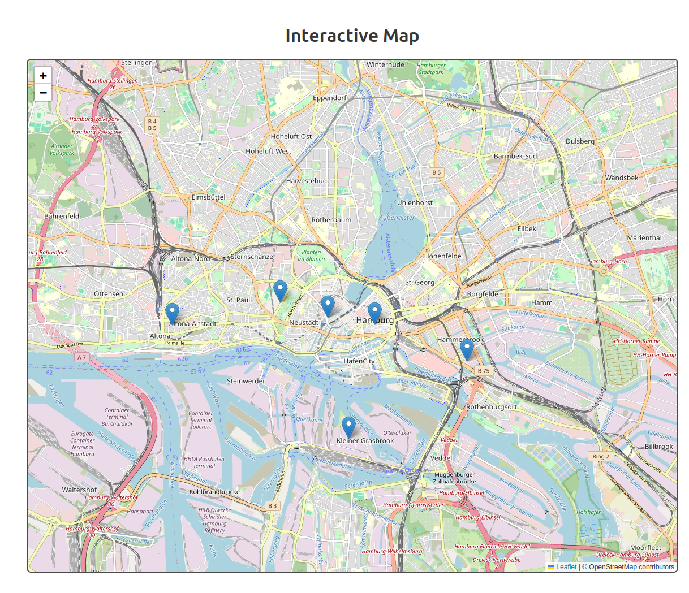
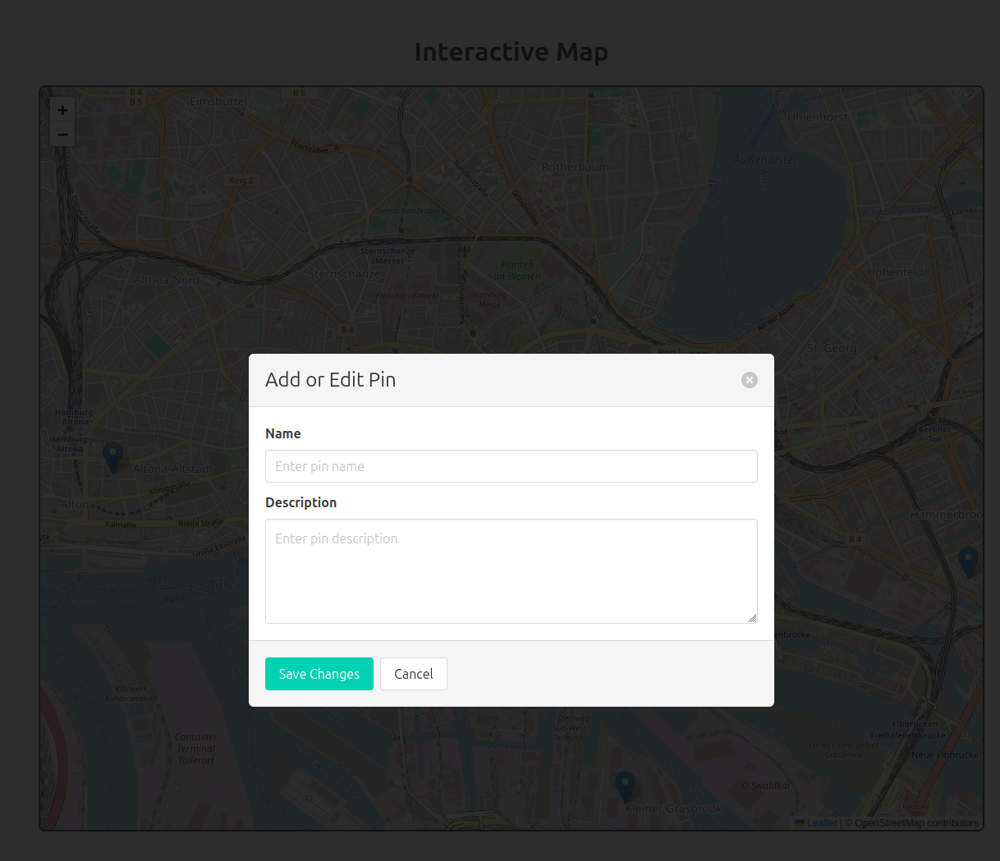
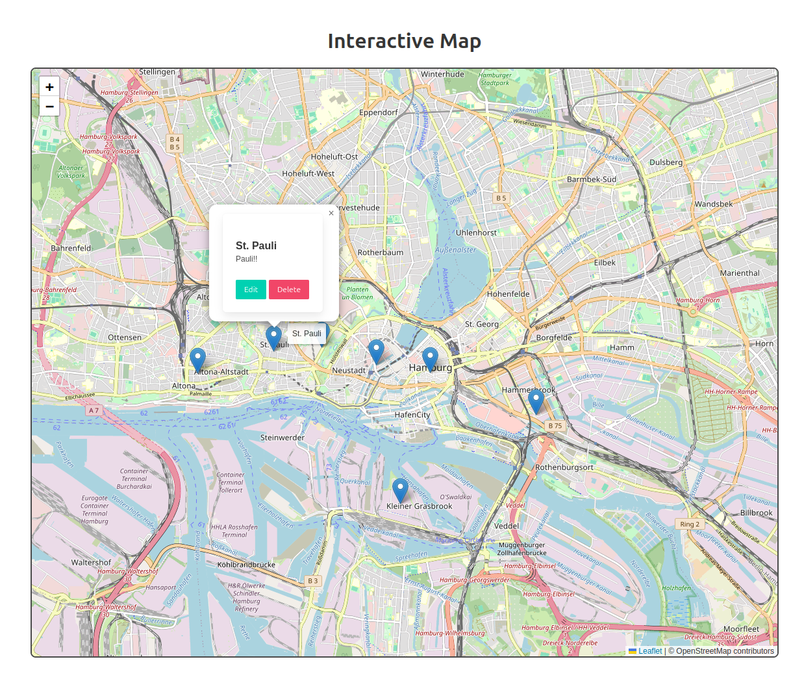

# Interactive Map Project

An interactive web application using **Spring Boot**, **Leaflet.js**, and **MySQL** to create, edit, and manage map pinpoints.

## Features

- Display an interactive map powered by [Leaflet.js](https://leafletjs.com/).
- Add new pinpoints by clicking on the map.
- Edit existing pinpoints.
- Delete pinpoints from the map.
- Persistent storage using a MySQL database.
- Responsive design with external CSS styling.

## Tech Stack

- **Backend**: Spring Boot (Java)
- **Frontend**: Leaflet.js, Thymeleaf, HTML, CSS
- **Database**: MySQL
- **Build Tool**: Maven

## Setup Instructions

1. **Clone the Repository**
   ```bash
   git clone <repository-url>
   cd <repository-directory>
   ```

2. **Setup MySQL Database**
   - Create a MySQL database named `demo_openMap`.
   - Update the database connection properties in `src/main/resources/application.properties`:
     ```properties
     spring.datasource.url=jdbc:mysql://localhost:3306/demo_openMap
     spring.datasource.username=<your-username>
     spring.datasource.password=<your-password>
     spring.jpa.hibernate.ddl-auto=update
     ```

3. **Run the Application**
   - Open a terminal in the project directory and execute:
     ```bash
     ./mvnw spring-boot:run
     ```
   - The application will be available at `http://localhost:8080`.

4. **Access the Application**
   - Open a web browser and navigate to `http://localhost:8080` to view the interactive map.

## Project Structure

- **`src/main/java`**: Backend code (controllers, services, and models).
- **`src/main/resources`**: Configuration files, templates, and static resources.
  - `templates/index.html`: HTML page for the interactive map.
  - `static/js/main.js`: JavaScript file with map logic.
  - `static/css/styles.css`: CSS for map and form styling.

## How to Use

1. **Add a Pinpoint**:
   - Click anywhere on the map to open the form for adding a pinpoint.
   - Enter the name and description, then click "Save Changes"



2. **Edit a Pinpoint**:
   - Click on an existing pinpoint marker.
   - Select the "Edit" button in the popup.
   - Enter the new details in the prompt and confirm.


3. **Delete a Pinpoint**:
   - Click on a marker.
   - Select the "Delete" button in the popup.

## API Endpoints

- **GET `/api/pinpoints`**: Fetch all pinpoints.
- **POST `/add-pin`**: Add a new pinpoint.
- **PUT `/edit-pin/{id}`**: Edit an existing pinpoint.
- **DELETE `/delete-pin/{id}`**: Delete a pinpoint by ID.

## Dependencies

- Spring Boot
- Leaflet.js
- MySQL Connector
- Thymeleaf
- Maven Wrapper


